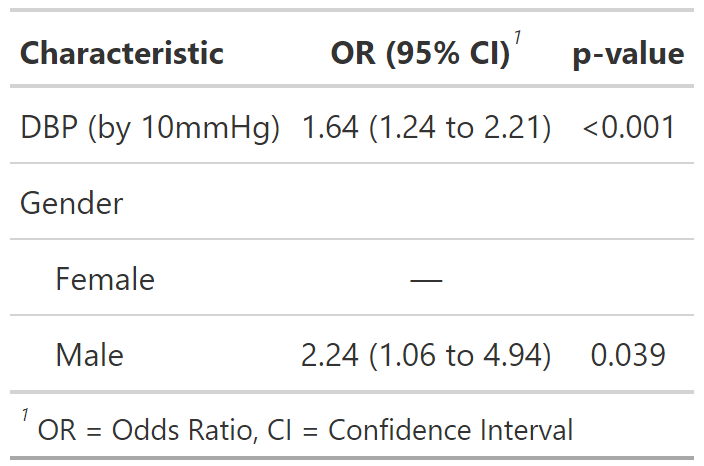
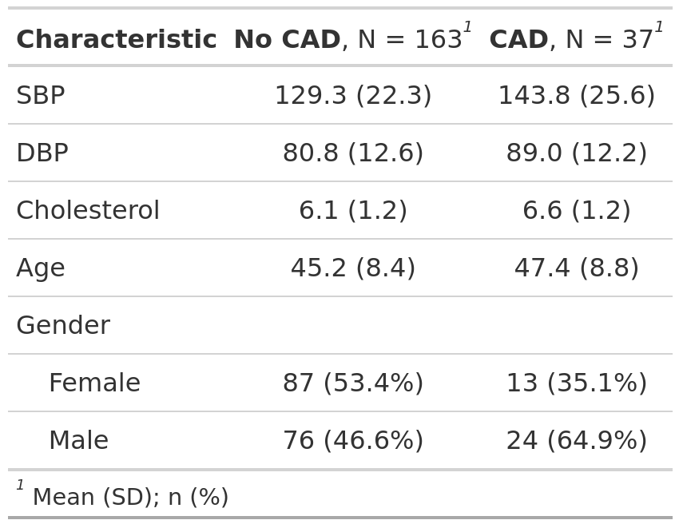

```{r setup, include=FALSE}
options(htmltools.dir.version = FALSE)
knitr::opts_chunk$set(
  fig.width=9, fig.height=3.5, fig.retina=3,
  out.width = "100%",
  comment = NA,
  cache = FALSE,
  echo = TRUE,
  message = FALSE, 
  warning = FALSE,
  hiline = TRUE
)
```

```{r libraries, include=FALSE, warning=FALSE}
# library(epiDisplay)
# data(BP)
# BP = na.omit(BP)
BP = read.csv("bp.csv") |> na.omit()
r_blue = fontawesome::fa("r-project", fill = "steelblue")
heart_red = fontawesome::fa("heart", fill = "red", prefer_type = "solid")
smile = fontawesome::fa("face-smile-wink")
or_ci = function(out_tidy_or, r = 2) {
  paste0(
    out_or_tidy$estimate[r] |> round(3),
    " (95% CI: ",
    out_or_tidy$conf.low[r] |> round(3),
    ", ",
    out_or_tidy$conf.high[r] |> round(3),
    ")"
  )
}
```

```{r xaringan-themer, include=FALSE, warning=FALSE}
library(xaringanthemer)
style_mono_accent(base_color = "#165CAA",
                  code_font_size = "0.65rem",
                  table_row_border_color = "#000",
                  table_row_even_background_color = "#FFF",
                  title_slide_background_color = "#FFF",
                  title_slide_text_color = "#165CAA",
                  )
```

```{r xaringan-logo, echo=FALSE}
xaringanExtra::use_logo(
  image_url = "img/r-user-malaysia-logo.png"
)
```

```{r xaringan-banner, echo=FALSE}
xaringanExtra::use_banner(
  bottom_center = "R Conference Malaysia 2024",
  top_left = "Publication-ready Statistical Results Using R",
  bottom_left = "Dr. Wan Nor Arifin",
  exclude = "title-slide"
)
```

## Outlines

- #### Preparing & Presenting Results
- #### Prepare Publication-ready Results Using `r r_blue`
- #### Other Potentials Using `r r_blue`

---
class: center, middle

# Preparing & Presenting Results

---
## Raw output _vs_ Expected output 

.pull-left[
#### Raw analysis results &#x1F631;&#x1F631;&#x1F631;
```{r, echo=FALSE}
data = foreign::read.spss("slog.sav",T,T)
data$dbp10 = data$dbp/10
mlog = glm(cad ~ dbp10 + gender, "binomial", data)
summary(mlog)
```
]

--

.pull-right[
#### Expected presentation format &#x1F44D;&#x1F44D;&#x1F44D;
<span>
```{r, echo=FALSE}
out_tidy = broom::tidy(mlog)
out_or_tidy = broom::tidy(mlog, exp = T, conf.int = T)
out = tibble::tibble(
  Factors = c("DBP (by 10mmHg)", "Gender (Male vs Female)"),
  "_b_" = out_tidy$estimate[-1],
  SE = out_tidy$std.error[-1],
  "Adj. OR" = out_or_tidy$estimate[-1],
  "95% CI" = paste0(out_or_tidy$conf.low[-1]|>round(3), ", ", out_or_tidy$conf.high[-1]|>round(3)),
  "_z_-stats" = out_tidy$statistic[-1],
  "_P_-value" = out_tidy$p.value[-1]
)
kbl = knitr::kable(out, format = "html", digits = 3,
                   caption = "<span style='font-size:small'>
                   **Table 1**: Associated factors of coronary artery disease (_n_ = 200)
                   </span>")
kableExtra::kable_styling(kbl, font_size = 12) |>
  kableExtra::kable_classic(html_font = "Georgia") |>
  kableExtra::row_spec(row = 0, bold = T) |>
  #kableExtra::add_footnote(label = "OR = odds ratio, SE = standard error.", notation = "none") #|>
  kableExtra::footnote(general = "OR = odds ratio, SE = standard error.", general_title = "") -> out_pres_tbl
out_pres_tbl
```
</span>
]

---
## Issues in Preparing & Presenting Statistical Results
- **Raw outputs &mdash; not suitable for publication / thesis / report / presentation**
- Different standards & guidelines for each
- Preparation &mdash; tedious, nightmare, error-prone!


---
## Issues in Preparing & Presenting Statistical Results
- **Raw outputs &mdash; not suitable for publication / thesis / report / presentation**
- **Different standards & guidelines for each**
- Preparation &mdash; tedious, nightmare, error-prone!


---
## Issues in Preparing & Presenting Statistical Results
- **Raw outputs &mdash; not suitable for publication / thesis / report / presentation**
- **Different standards & guidelines for each**
- **Preparation &mdash; tedious, nightmare, error-prone!**


<br/><small><small>*Images generated with Copilot</small></small>

---
## Analyze & Prepare Statistical Results Using `r r_blue`
- Raw outputs from `r r_blue` can be unsightly
- But, `r r_blue` outputs are easy to **reprocess**
- Packages and functions are abundant in `r r_blue` to refine raw outputs
- A breeze in `r r_blue` as compared to other statistical software
- Usually in combination with `R Markdown` / `Quarto Document`

--

.center[Table and plot straight from `r r_blue`!]
.pull-left[
<span>
```{r, echo=FALSE}
out_pres_tbl
```
</span>
]
.pull-right[
```{r echo=FALSE}
attr(data$cad, "label") = "Coronary artery disease"
attr(data$dbp10, "label") = "DBP (by 10mmHg)"
data$gender = factor(data$gender, labels=c("Female","Male"))
attr(data$gender, "label") = "Gender (vs Female)"
explanatory = c("dbp10", "gender")
dependent = 'cad'
finalfit::or_plot(data, dependent, explanatory,
                  dependent_label = "Odds ratio (OR) of coronary artery disease by factor",
                  suffix = "",
                  remove_ref = T,
                  title_text_size = 16,
                  table_text_size = 5,
                  plot_opts = list(ggplot2::xlab("OR (95% CI)")))
```
.center[<span style='font-size:small;font-family:Georgia'>**Figure 1**: Associated factors of coronary artery disease (_n_ = 250)</span>]
]

---
class: center, middle

# Prepare Publication-ready Results Using R

---

## Formats of Statistical Results

.pull-left[
#### Table
<span>
```{r, echo=FALSE}
knitr::kable(out, format = "html", digits = 3) |>
  kableExtra::kable_styling(font_size = 12, html_font = "Georgia") |>
  kableExtra::row_spec(row = 0, bold = T)
```
</span>

#### In-text statistics
<span style="font-family:Georgia;font-size:0.7em;">
Individuals with higher diastolic blood pressure (DBP) have higher odds of developing coronary artery disease (CAD), with an adjusted odds ratio (OR) of `r or_ci(out_tidy_or, 2)` for every 10mmHg increase in DBP. In addition, males have higher odds of developing CAD compared to females, with adjusted OR of `r or_ci(out_tidy_or, 3)`.
</span>
]

.pull-right[
#### Plot
<span>
```{r, echo=FALSE}
attr(data$gender, "label") = "Gender"
finalfit::or_plot(data, dependent, explanatory,
                  dependent_label = "",
                  suffix = "",
                  title_text_size = 16,
                  table_text_size = 5,
                  plot_opts = list(ggplot2::xlab("OR (95% CI)")))
```
</span>
]

---

## Approaches in R

- **Ready-made outputs** &mdash; basic outputs from packages
- **Custom outputs** &mdash; fine-tune outputs from packages
- **Custom functions** &mdash; custom outputs, avoid repetition from existing functions

--
<br/><br/><br/><br/>
.center[
###There are so many options available in `r r_blue`, amazing & exciting! ]

---

## Table

.pull-left[
#### Ready-made outputs

  - So many packages for this purpose
  - `gtsummary` `r heart_red`
  - Summary tables for analysis: `epidisplay`, `finalfit`, `jtools`, `stargazer`, `jmv`, ...
  - Descriptive tables: `arsenal`, `table1`, ...
  - and many more...?

#### Custom outputs

  - `knitr`: `kable()` `r heart_red`, `kableExtra` `r heart_red`
  - `broom`: `tidy()` `r heart_red`
  - `gt`, `flextable`
  - more...?
]

.pull-right[
#### Custom functions

  - Mix & match preceding functions for repeated use, i.e. same format for same statistical analysis
  - Save your time, more readable code, reuse for your specific need
]

---

## Table

.pull-left[
#### Ready-made outputs

  - So many packages for this purpose
  - `gtsummary` `r heart_red`
  - Summary tables for analysis: `epidisplay`, `finalfit`, `jtools`, `stargazer`, `jmv`, ...
  - Descriptive tables: `arsenal`, `table1`, ...
  - and many more...?

#### Custom outputs

  - `knitr`: `kable()` `r heart_red`, `kableExtra` `r heart_red`
  - `broom`: `tidy()` `r heart_red`
  - `gt`, `flextable`
  - more...?
]

.pull-right[
#### Custom functions

  - Mix & match preceding functions for repeated use, i.e. same format for same statistical analysis
  - Save your time, more readable code, reuse for your specific need

These packages & options usually allow you to get output as plain text, HTML, LaTeX or Word formats, even as image or PDF. So, these are adaptable to any document.
```{r, echo=FALSE, eval=FALSE}
capture.output(object, file = "object.txt")
```
]

---

##  Table: Ready-made outputs

.pull-left[
#### R code: Setup data & analyze
```{r, eval=FALSE}
# load & prepare data
data = foreign::read.spss("slog.sav",T,T)
data$dbp10 = data$dbp/10
data$gender = factor(data$gender, labels = c("Female","Male"))
# analyze
mlog = glm(cad ~ dbp10 + gender, "binomial", data)
```

#### R code: Prepare & present
```{r, eval=FALSE}
# present
gtsummary::theme_gtsummary_journal("jama")  # specify theme
gtsummary::tbl_regression(mlog, exponentiate = TRUE, #<<
                          label = list(
                            dbp10 = "DBP (by 10mmHg)",
                            gender = "Gender"))
gtsummary::reset_gtsummary_theme()
```
]

--

.pull-right[
#### Output
```{r, echo=FALSE}
# load & prepare data
data = foreign::read.spss("slog.sav",T,T)
data$dbp10 = data$dbp/10
data$gender = factor(data$gender, labels=c("Female","Male"))
# analyze
mlog = glm(cad ~ dbp10 + gender, "binomial", data)
# present
gtsummary::theme_gtsummary_journal("jama")  
gtsummary::tbl_regression(mlog, exponentiate = TRUE,
                          label = list(
                            dbp10 = "DBP (by 10mmHg)",
                            gender = "Gender")) |>
  gtsummary::as_gt() |>
  gt::gtsave("img/tbl_or.png")
gtsummary::reset_gtsummary_theme()
```
.center[

]
]

---

##  Table: Ready-made outputs

.pull-left[
#### R code: Prepare data
```{r, eval=FALSE}
# load & prepare data
data = foreign::read.spss("slog.sav",T,T)
data$cad = factor(data$cad, labels = c("No CAD", "CAD"))
data$gender = factor(data$gender, labels=c("Female","Male"))
```

#### R code: Present
```{r, eval=FALSE}
# present
library(gtsummary) # for all_x() settings
gtsummary::tbl_summary( #<<
  subset(data, select = c(cad, sbp:age, gender)),
  by = cad,
  label = list(cad = "CAD", sbp = "SBP",
               dbp = "DBP", chol = "Cholesterol",
               age = "Age", gender = "Gender"),
  statistic = list(
    all_continuous() ~ "{mean} ({sd})",
    all_categorical() ~ "{n} ({p}%)"),
  digits = list(all_continuous() ~ c(1,1),
                all_categorical() ~ c(0,1)))
```
]

--

.pull-right[
#### Output
```{r, echo=FALSE}
# load & prepare data
data = foreign::read.spss("slog.sav",T,T)
data$cad = factor(data$cad, 
                   labels = c("No CAD", "CAD"))
data$gender = factor(data$gender, 
                     labels=c("Female","Male"))
# present
library(gtsummary) # for all_x() settings
gtsummary::tbl_summary(
  subset(data, select = c(cad, sbp:age, gender)),
  by = cad,
  label = list(cad = "CAD",
               sbp = "SBP",
               dbp = "DBP",
               chol = "Cholesterol",
               age = "Age",
               gender = "Gender"),
  statistic = list(
    all_continuous() ~ "{mean} ({sd})",
    all_categorical() ~ "{n} ({p}%)"),
  digits = list(all_continuous() ~ c(1,1),
                all_categorical() ~ c(0,1))) |>
  gtsummary::as_gt() |>
  gt::gtsave("img/tbl_des.png")
```
.center[

]
]

---

## Table: Ready-made outputs

.pull-left[
#### R code: Prepare data
```{r, eval=FALSE}
# load & prepare data
data = foreign::read.spss("slog.sav",T,T)
data$cad = factor(data$cad, 
                   labels = c("No CAD", "CAD"))
data$gender = factor(data$gender, 
                     labels=c("Female","Male"))
```

#### R code: Present
```{r, eval=FALSE}
# present
gtsummary::theme_gtsummary_journal("jama") # combine
gtsummary::theme_gtsummary_mean_sd()       # two themes
gtsummary::tbl_summary( #<<
  subset(data, select = c(cad, sbp:age, gender)),
  by = cad,
  label = list(cad = "CAD", sbp = "SBP",
               dbp = "DBP", chol = "Cholesterol",
               age = "Age", gender = "Gender"),
  digits = list(all_continuous() ~ c(1,1),
                all_categorical() ~ c(0,1)))
gtsummary::reset_gtsummary_theme()
```
]

--

.pull-right[
#### Output
```{r, echo=FALSE}
# load & prepare data
data = foreign::read.spss("slog.sav",T,T)
data$cad = factor(data$cad, 
                   labels = c("No CAD", "CAD"))
data$gender = factor(data$gender, 
                     labels=c("Female","Male"))
# present
gtsummary::theme_gtsummary_journal("jama") # combine
gtsummary::theme_gtsummary_mean_sd()       # two themes
gtsummary::tbl_summary(
  subset(data, select = c(cad, sbp:age, gender)),
  by = cad,
  label = list(cad = "CAD", sbp = "SBP",
               dbp = "DBP", chol = "Cholesterol",
               age = "Age", gender = "Gender"),
  digits = list(all_continuous() ~ c(1,1),
                all_categorical() ~ c(0,1)))
gtsummary::reset_gtsummary_theme()
```
]

---

##  Table: Custom outputs

.pull-left[
#### R code: Setup data & analyze
```{r, eval=FALSE}
# load & prepare data
data = foreign::read.spss("slog.sav",T,T)
data$dbp10 = data$dbp/10
# analyze
mlog = glm(cad ~ dbp10 + gender, "binomial", data)
```


#### R code: Prepare with `broom::tidy()` + `tibble`
```{r, eval=FALSE}
out_tidy = broom::tidy(mlog) #<<
out_or_tidy = broom::tidy(mlog, exp = T, conf.int = T) #<<
out = tibble::tibble( #<<
  Factors = c("DBP (by 10mmHg)", "Gender (Male vs Female)"),
  "_b_" = out_tidy$estimate[-1], SE = out_tidy$std.error[-1],
  "Adj. OR" = out_or_tidy$estimate[-1],
  "95% CI" = paste0(out_or_tidy$conf.low[-1]|>round(3), 
                    ", ",
                    out_or_tidy$conf.high[-1]|>round(3)),
  "_z_-stats" = out_tidy$statistic[-1],
  "_P_-value" = out_tidy$p.value[-1]
); out
```
]

--

.pull-right[
#### Output: Unformatted
```{r, echo=FALSE}
data = foreign::read.spss("slog.sav",T,T)
data$dbp10 = data$dbp/10
mlog = glm(cad ~ dbp10 + gender, "binomial", data)
out_tidy = broom::tidy(mlog)
out_or_tidy = broom::tidy(mlog, exp = T, conf.int = T)
out = tibble::tibble(
  Factors = c("DBP (by 10mmHg)", "Gender (Male vs Female)"),
  "_b_" = out_tidy$estimate[-1],
  SE = out_tidy$std.error[-1],
  "Adj. OR" = out_or_tidy$estimate[-1],
  "95% CI" = paste0(out_or_tidy$conf.low[-1]|>round(3), 
                    ", ",
                    out_or_tidy$conf.high[-1]|>round(3)),
  "_z_-stats" = out_tidy$statistic[-1],
  "_P_-value" = out_tidy$p.value[-1]
)
out[1:5]
out[6:7]
```
]

---

## Table: Custom outputs

.pull-left[
#### R code: Present with `knitr::kable()` + `kableextra`
```{r, eval=FALSE}
knitr::kable(out, format = "html", digits = 3, #<<
             caption = "<span style='font-size:small'>
                   **Table 1**: Associated factors of 
                   coronary artery disease (_n_ = 200)
                   </span>") |>
  kableExtra::kable_styling(font_size = 12) |> #<<
  kableExtra::kable_classic(html_font = "Georgia") |>
  kableExtra::row_spec(row = 0, bold = T) |>
  kableExtra::footnote(general = "OR = odds ratio, 
                       SE = standard error.", 
                       general_title = "")
```
]

--

.pull-right[
#### Output
<span>
```{r, echo=FALSE}
knitr::kable(out, format = "html", digits = 3,
                   caption = "<span style='font-size:small'>
                   **Table 1**: Associated factors of 
                   coronary artery disease (_n_ = 200)
                   </span>") |>
  kableExtra::kable_styling(font_size = 12) |>
  kableExtra::kable_classic(html_font = "Georgia") |>
  kableExtra::row_spec(row = 0, bold = T) |>
  kableExtra::footnote(general = "OR = odds ratio, SE = standard error.", general_title = "")
```
</span>
]

---

## Table: Custom functions

.pull-left[
#### R code: Function `mlg_tbl()`
```{r, eval=FALSE}
mlog_tbl = function(mlog_glm) { #<<
  out_tidy = broom::tidy(mlog_glm)
  out_or_tidy = broom::tidy(mlog_glm, exp = T, conf.int = T)
  tibble::tibble(
    Factors = out_tidy$term[-1],
    "_b_" = out_tidy$estimate[-1],
    SE = out_tidy$std.error[-1],
    "Adj. OR" = out_or_tidy$estimate[-1],
    "95% CI" = paste0(out_or_tidy$conf.low[-1]|>round(3), 
                      ", ",
                      out_or_tidy$conf.high[-1]|>round(3)),
    "_z_-stats" = out_tidy$statistic[-1],
    "_P_-value" = out_tidy$p.value[-1])
}
```
]

.pull-right[
#### R code: Function `mlg_kbl()`
```{r, eval=FALSE}
mlog_kbl = function(mlog_tbl, caption = "Table", #<<
                    font_size = 12, 
                    font_family = "Georgia") {
  knitr::kable(mlog_tbl, format = "html", digits = 3,
               caption = caption) |>
    kableExtra::kable_styling(font_size = font_size) |>
    kableExtra::kable_classic(html_font = font_family) |>
    kableExtra::row_spec(row = 0, bold = T) |>
    kableExtra::footnote(general = "OR = odds ratio, 
                       SE = standard error.", 
                       general_title = "")
}
```
]

---

## Table: Custom functions

.pull-left[
#### R code: `mlg_tbl()` + `mlg_kbl`
```{r, eval=FALSE}
# present table
tbl1 = mlog_tbl(mlog) #<<
tbl1$Factors = c("DBP (by 10mmHg)", "Gender (Male vs Female)")
tbl1_caption = paste0(
  "**Table 1**: Associated factors of CAD (_n_ = ",
  nrow(mlog$data), ")")
mlog_kbl(tbl1, caption = tbl1_caption, #<<
         font_size = 14, font_family = "Comic Sans MS") #<<
```
Shorter, reusable code in lengthy document
]

--

.pull-right[
#### Output
<span>
```{r, echo=FALSE}
mlog_tbl = function(mlog_glm) { #<<
  out_tidy = broom::tidy(mlog_glm)
  out_or_tidy = broom::tidy(mlog_glm, exp = T, conf.int = T)
  tibble::tibble(
    Factors = out_tidy$term[-1],
    "_b_" = out_tidy$estimate[-1],
    SE = out_tidy$std.error[-1],
    "Adj. OR" = out_or_tidy$estimate[-1],
    "95% CI" = paste0(out_or_tidy$conf.low[-1]|>round(3), 
                      ", ",
                      out_or_tidy$conf.high[-1]|>round(3)),
    "_z_-stats" = out_tidy$statistic[-1],
    "_P_-value" = out_tidy$p.value[-1])
}
mlog_kbl = function(mlog_tbl, caption = "Table", #<<
                    font_size = 12, 
                    font_family = "Georgia") {
  knitr::kable(mlog_tbl, format = "html", digits = 3,
               caption = caption) |>
    kableExtra::kable_styling(font_size = font_size) |>
    kableExtra::kable_classic(html_font = font_family) |>
    kableExtra::row_spec(row = 0, bold = T) |>
    kableExtra::footnote(general = "OR = odds ratio, SE = standard error.", general_title = "")
}
# the table
mlog_tbl(mlog) -> tbl1
tbl1$Factors = c("DBP (by 10mmHg)", "Gender (Male vs Female)")
tbl1_caption = paste0("**Table 1**: Associated factors of CAD (_n_ = ",
                      nrow(mlog$data), ")")
mlog_kbl(tbl1, caption = tbl1_caption,
         font_size = 14, font_family = "Comic Sans MS")
```
</span>

_Comic Sans MS_ &#x1F60A;
]

---

## Plot

.pull-left[
####  Ready-made outputs

  - Usually available in specific packages for specific analyses, must explore
  - Mostly rely on `ggplot2` `r heart_red` and base `graphics` `r heart_red`
  - Examples: `semPlot` (SEM path diagram) `r heart_red`, `OptimalCutpoints` (ROC curve), `finalfit` (OR plot), `survival` (survival analysis) &rarr; note they are usually tied to specific analyses
  - Again, explore!
]

.pull-right[
####  Custom outputs

  - Customize options in above packages
  - `ggplot2` `r heart_red`, base `graphics` `r heart_red`, `lattice`

####  Custom functions

  - Graphics options are often too many and tedious to repeatedly use without affecting readability of your code
  - Advisable to write functions for customizing the plots for your specific data and use-case
]

--

These packages & options usually allow you get output several image formats e.g. png, svg, pdf etc. So, this can be easily integrated in any document.

---

## Plot: Ready-made outputs

.pull-left[
#### R code
```{r, eval=FALSE}
attr(data$cad, "label") = "Coronary artery disease"
attr(data$dbp10, "label") = "DBP (by 10mmHg)"
attr(data$gender, "label") = "Gender"
data$gender = factor(data$gender, labels=c("Female","Male"))
finalfit::or_plot(data, dependent, explanatory) #<<
```
]

.pull-right[
#### Output
<span>
```{r, echo=FALSE}
attr(data$cad, "label") = "Coronary artery disease"
attr(data$dbp10, "label") = "DBP (by 10mmHg)"
attr(data$gender, "label") = "Gender"
data$gender = factor(data$gender, labels=c("Female","Male"))
explanatory = c("dbp10", "gender")
dependent = 'cad'
finalfit::or_plot(data, dependent, explanatory)
```
</span>
]

---

##  Plot: Ready-made outputs

.pull-left[
#### R code
```{r, eval=FALSE}
attr(data$cad, "label") = "Coronary artery disease"
attr(data$dbp10, "label") = "DBP (by 10mmHg)"
data$gender = factor(data$gender, labels=c("Female","Male"))
attr(data$gender, "label") = "Gender (vs Female)"
explanatory = c("dbp10", "gender")
dependent = "cad"
finalfit::or_plot(data, dependent, explanatory,
                  dependent_label = "Odds ratio (OR) of
                  coronary artery disease by factor",
                  suffix = "",
                  remove_ref = T,
                  title_text_size = 16,
                  table_text_size = 5,
                  plot_opts = 
                    list(ggplot2::xlab("OR (95% CI)")))
```
]

.pull-right[
#### Output
<span>
```{r, echo=FALSE}
attr(data$cad, "label") = "Coronary artery disease"
attr(data$dbp10, "label") = "DBP (by 10mmHg)"
data$gender = factor(data$gender, labels=c("Female","Male"))
attr(data$gender, "label") = "Gender (vs Female)"
explanatory = c("dbp10", "gender")
dependent = "cad"
finalfit::or_plot(data, dependent, explanatory, #<<
                  dependent_label = "Odds ratio (OR) of coronary artery disease by factor",
                  suffix = "",
                  remove_ref = T,
                  title_text_size = 16,
                  table_text_size = 5,
                  plot_opts = list(ggplot2::xlab("OR (95% CI)")))
```
</span>
]

---

##  Plot: Ready-made outputs

.pull-left[
#### R code
```{r eval=FALSE}
# SEM model
model = "
F1 =~ Q1 + Q2 + Q3 + Q4 + Q5
F2 =~ Q6 + Q7 + Q8 + Q9 + Q10
F2 ~ F1
"
survey = lavaan::simulateData(model) # sim. data for practice
fit_model = lavaan::sem(model, data = survey)
# draw path diagram
semPlot::semPaths(fit_model, what="path", #<<
                  whatLabels="name", edge.color = "black",
                  layout = "tree2", rotation = 2)
```
]

.pull-right[
#### Output
```{r echo=FALSE, fig.height=7}
# SEM model
model = "
F1 =~ Q1 + Q2 + Q3 + Q4 + Q5
F2 =~ Q6 + Q7 + Q8 + Q9 + Q10
F2 ~ F1
"
survey = lavaan::simulateData(model)
fit_model = lavaan::sem(model, data = survey)
# draw path diagram
semPlot::semPaths(fit_model, what="path",
                  whatLabels="name", edge.color = "black",
                  layout = "tree2", rotation = 2)
```
]

---

##  Plot: Ready-made outputs

.pull-left[
#### R code
```{r eval=FALSE}
data1 = data
data1$p_mlog = 
  predict(mlog, type = "response") # probability
OptimalCutpoints::optimal.cutpoints(X = "p_mlog", 
                                    status = "cad", 
                                    tag.healthy = "no cad",
                                    methods = "Youden", 
                                    data = data1,
                                    ci.fit = TRUE) |> 
  plot(which = 1)
```
]

.pull-right[
#### Output
```{r, echo=FALSE, fig.height=7}
data1 = data
data1$p_mlog = 
  predict(mlog, type = "response") # probability
OptimalCutpoints::optimal.cutpoints(X = "p_mlog", 
                                    status = "cad", 
                                    tag.healthy = "no cad",
                                    methods = "Youden", 
                                    data = data1,
                                    ci.fit = TRUE) |> 
  plot(which = 1) #<<
```
]

---

##  Plot: Custom outputs

Can use `ggplot2`, base `graphics` or `lattice`.

Typically, you have to customize the plot, this deserves a separate talk.

But, most often the settings are lengthy! &rarr; require custom functions for repeatedly used plots.

---

## Plot: Custom functions

.pull-left[
#### R code: Simulated data
```{r, eval=FALSE}
set.seed(007)
data_hist = tibble::tibble(
  "Weight (kg)" = rnorm(1000, mean = 50, sd = 15),
  "Height (cm)" = rnorm(1000, mean = 150, sd = 10))
```

#### R code: Histogram by `ggplot2`
```{r, eval=FALSE}
library(ggplot2)
ggplot(data = data_hist, aes(`Weight (kg)`)) +
  geom_histogram(bins = 10)
```
]

--

.pull-right[
#### Output: Without customization
```{r, echo=FALSE, fig.height=6}
set.seed(007)
data_hist = tibble::tibble(
  "Weight (kg)" = rnorm(1000, mean = 50, sd = 15),
  "Height (cm)" = rnorm(1000, mean = 150, sd = 10)
)
library(ggplot2)
ggplot(data = data_hist, aes(`Weight (kg)`)) +
  geom_histogram(bins = 10)
```
]

---

## Plot: Custom functions

.pull-left[
#### R code: Simulated data
```{r, eval=FALSE}
set.seed(007)
data_hist = tibble::tibble(
  "Weight (kg)" = rnorm(1000, mean = 50, sd = 15),
  "Height (cm)" = rnorm(1000, mean = 150, sd = 10))
```

#### R code: Histogram by `ggplot2`
```{r, eval=FALSE}
library(ggplot2)
ggplot(data = data_hist, aes(`Weight (kg)`)) +
  geom_histogram(bins = 10, color = "black", 
                 fill = "cornsilk", alpha = 0.5) +
  labs(title = "Histogram of Weight (kg)", y = "Frequency") +
  theme_classic() +
  theme(plot.title = element_text(color = "steelblue", 
                       size = 16, face = "bold", hjust = 0.5),
        axis.title = element_text(hjust = 1),
        axis.line = element_line(
          arrow = grid::arrow(length = unit(.2, "cm"))))
```
]

.pull-right[
#### Output: With customization + **lengthy options**
```{r, echo=FALSE, fig.height=6}
set.seed(007)
data_hist = tibble::tibble(
  "Weight (kg)" = rnorm(1000, mean = 50, sd = 15),
  "Height (cm)" = rnorm(1000, mean = 150, sd = 10)
)
library(ggplot2)
ggplot(data = data_hist, aes(`Weight (kg)`)) +
  geom_histogram(bins = 10, color = "black", 
                 fill = "cornsilk", alpha = 0.5) +
  labs(title = "Histogram of Weight (kg)", y = "Frequency") +
  theme_classic() +
  theme(plot.title = element_text(color = "steelblue", 
                       size = 16, face = "bold", hjust = 0.5),
        axis.title = element_text(hjust = 1),
        axis.line = element_line(
          arrow = grid::arrow(length = unit(.2, "cm"))))
```
]

---

## Plot: Custom functions

.pull-left[
#### R code: Function `my_hist`
```{r, eval=FALSE}
my_hist = function(data, variable, bins = 10) {  #<<
  title_x = paste0("Histogram of ", 
                   names(data[variable]))
  ggplot2::ggplot(data = data, aes(.data[[variable]])) +
    ggplot2::geom_histogram(bins = bins, color = "black", 
                            fill = "cornsilk", alpha = 0.5) +
    ggplot2::labs(title = title_x, y = "Frequency") +
    ggplot2::theme_classic() +
    ggplot2::theme(
      plot.title = 
        ggplot2::element_text(
          color = "steelblue", 
          size = 16, face = "bold",
          hjust = 0.5),
      axis.title = ggplot2::element_text(hjust = 1),
      axis.line = ggplot2::element_line(
        arrow = grid::arrow(length = unit(.2, "cm"))))
}
```
]

.pull-right[
]

---

## Plot: Custom functions

.pull-left[
#### R code: `my_hist` with **Weight (kg)**
```{r, eval=FALSE}
set.seed(007)
data_hist = tibble::tibble(
  "Weight (kg)" = rnorm(1000, mean = 50, sd = 15),
  "Height (cm)" = rnorm(1000, mean = 150, sd = 10)
)
my_hist(data_hist, "Weight (kg)") #<<
```
]

--

.pull-right[
#### Output
```{r, echo=FALSE}
set.seed(007)
data_hist = tibble::tibble(
  "Weight (kg)" = rnorm(1000, mean = 50, sd = 15),
  "Height (cm)" = rnorm(1000, mean = 150, sd = 10)
)
my_hist = function(data, variable, bins = 10) {  #<<
  title_x = paste0("Histogram of ", 
                   names(data[variable]))
  ggplot2::ggplot(data = data, aes(.data[[variable]])) +
    ggplot2::geom_histogram(bins = 10, color = "black", 
                            fill = "cornsilk", alpha = 0.5) +
    ggplot2::labs(title = title_x, y = "Frequency") +
    ggplot2::theme_classic() +
    ggplot2::theme(
      plot.title = 
        ggplot2::element_text(
          color = "steelblue", 
          size = 16, face = "bold",
          hjust = 0.5),
      axis.title = ggplot2::element_text(hjust = 1),
      axis.line = ggplot2::element_line(
        arrow = grid::arrow(length = unit(.2, "cm"))))
}
my_hist(data_hist, "Weight (kg)")
```
]

---

## Plot: Custom functions

.pull-left[
#### R code: `my_hist` with **Weight (kg)** and **Height (cm)**
```{r, eval=FALSE}
set.seed(007)
data_hist = tibble::tibble(
  "Weight (kg)" = rnorm(1000, mean = 50, sd = 15),
  "Height (cm)" = rnorm(1000, mean = 150, sd = 10)
)
my_hist(data_hist, "Weight (kg)") #<<
my_hist(data_hist, "Height (cm)") #<<
```
]

.pull-right[
#### Output
```{r, echo=FALSE}
set.seed(007)
data_hist = tibble::tibble(
  "Weight (kg)" = rnorm(1000, mean = 50, sd = 15),
  "Height (cm)" = rnorm(1000, mean = 150, sd = 10)
)
my_hist = function(data, variable, bins = 10) {  #<<
  title_x = paste0("Histogram of ", 
                   names(data[variable]))
  ggplot2::ggplot(data = data, aes(.data[[variable]])) +
    ggplot2::geom_histogram(bins = 10, color = "black", 
                            fill = "cornsilk", alpha = 0.5) +
    ggplot2::labs(title = title_x, y = "Frequency") +
    ggplot2::theme_classic() +
    ggplot2::theme(
      plot.title = 
        ggplot2::element_text(
          color = "steelblue", 
          size = 16, face = "bold",
          hjust = 0.5),
      axis.title = ggplot2::element_text(hjust = 1),
      axis.line = ggplot2::element_line(
        arrow = grid::arrow(length = unit(.2, "cm"))))
}
my_hist(data_hist, "Weight (kg)")
my_hist(data_hist, "Height (cm)")
```
]

---

## In-text
For in-text ouput, <code>&#96;r code&#96;</code> is used with `R Markdown` to allow in-text integration.

.pull-left[
####  Ready-made outputs

  - Specific text results directly from functions, or subset of output objects
  - <code>&#96;r mean(x)&#96;</code>, <code>&#96;r object$x&#96;</code> etc
  - `gtsummary`'s `inline_text()`
  
####  Custom functions

  - Functions for repetitive `paste0()` use
  - mean (SD), _r_ coefficient (_p_-value = 0.xxx), OR (95% CI, LL OR, UL OR) etc
  - <code>&#96;r mean_sd(x)&#96;</code>, <code>&#96;r or_ci(object)&#96;</code> &rarr; simplify the code, easy to reuse
]

.pull-right[
####  Custom outputs

  - Combine all these, `paste()` and `paste0()` `r heart_red` are commonly used
  - <code>&#96;r paste0(mean(x), " (", sd(x), ")&#96;</code>
  - <code>&#96;r paste0(object$estimate, " (95% CI: ", object$LL, ", ", object$UL, ")")&#96;</code>
  - Can also save `paste0()` resulting objects, so can use <code>&#96;r mean_sd&#96;</code>, <code>&#96;r or_ci&#96;</code>
]

---

##  Text: Ready-made outputs

.pull-left[
#### R code
```{r eval=FALSE}
# analysis part
fit = lm(sbp ~ saltadd, BP)
# using broom
out = broom::tidy(fit, conf.int = T) #<<
```

#### Markdown
<span style="font-family:Lucida Console;font-size:0.7em;">There were \_n\_ = <code>&#96;r nrow(BP)&#96;</code> participants, with <code>&#96;r table(BP$sex)[2]&#96;</code> of them are females. The mean SBP was <code>&#96;r mean(BP$sbp)|>round(1)&#96;</code> (SD = <code>&#96;r sd(BP$sbp)|>round(1)&#96;</code>). From the regression analysis, adding salt to the food increases SBP by <code>&#96;r out$estimate[2]|>round(1)&#96;</code> mmHg.</span>
]

.pull-right[
#### Output
```{r echo=FALSE}
fit = lm(sbp ~ saltadd, BP)
out = broom::tidy(fit, conf.int = T)
```
<span style="font-family:Georgia;font-size:0.8em;">There were _n_ = `r nrow(BP)` participants, with `r table(BP$sex)[2]` of them are females. The mean SBP was `r mean(BP$sbp)|>round(1)` (SD = `r sd(BP$sbp)|>round(1)`). From the regression analysis, adding salt to the food increases SBP by `r out$estimate[2]|>round(1)` mmHg.</span>
]

---

##  Text: Ready-made outputs

.pull-left[
#### R code
```{r eval=FALSE}
# analysis part
fit = lm(sbp ~ saltadd, BP)
# using gtsummary
gtout = gtsummary::tbl_regression(fit, conf.int = T) #<<
```

#### Markdown
<span style="font-family:Lucida Console;font-size:0.7em;">There were \_n\_ = <code>&#96;r nrow(BP)&#96;</code> participants, with <code>&#96;r table(BP$sex)[2]&#96;</code> of them are females. The mean SBP was <code>&#96;r mean(BP$sbp)|>round(1)&#96;</code> (SD = <code>&#96;r sd(BP$sbp)|>round(1)&#96;</code>). From the regression analysis, adding salt to the food increases SBP by <code>&#96;r gtsummary::inline_text(gtout, variable = saltadd, level = "yes")&#96;</code> mmHg.</span>
]

.pull-right[
#### Output
```{r echo=FALSE}
fit = lm(sbp ~ saltadd, BP)
gtout = gtsummary::tbl_regression(fit, conf.int = T)
```
<span style="font-family:Georgia;font-size:0.8em;">There were _n_ = `r nrow(BP)` participants, with `r table(BP$sex)[2]` of them are females. The mean SBP was `r mean(BP$sbp)|>round(1)` (SD = `r sd(BP$sbp)|>round(1)`). From the regression analysis, adding salt to the food increases SBP by `r gtsummary::inline_text(gtout, variable = saltadd, level = "yes")` mmHg.</span>
]

---

##  Text: Custom outputs

.pull-left[
#### R code
```{r eval=FALSE}
tbl_sex = table(BP$sex) #<<
# analysis part
fit = lm(sbp ~ saltadd, BP)
out = broom::tidy(fit, conf.int = T)
coef_ci = paste0(out$estimate[2]|>round(1), #<<
    " (95% CI: ", out$conf.low[2]|>round(1), #<<
    ", ", out$conf.high[2]|>round(1), ")") #<<
```

#### Markdown
<span style="font-family:Lucida Console;font-size:0.7em;">
There were \_n\_ = <code>&#96;r nrow(BP)&#96;</code> participants, with <code>&#96;r tbl_sex[2]&#96;</code> (<code>&#96;r prop.table(tbl_sex)[2]|>round(3)*100&#96;</code>%) of them are females. The mean SBP was <code>&#96;r paste0(mean(BP$sbp)|>round(1), " (SD = ", sd(BP$sbp)|>round(1), ")")&#96;</code>. From the regression analysis, adding salt to the food increases SBP by <code>&#96;r coef_ci&#96;</code> mmHg.</span>
]

.pull-right[
#### Output
```{r echo=FALSE}
tbl_sex = table(BP$sex)
fit = lm(sbp ~ saltadd, BP)
out = broom::tidy(fit, conf.int = T)
coef_ci = paste0(out$estimate[2]|>round(1),
    " (95% CI: ", out$conf.low[2]|>round(1),
    ", ", out$conf.high[2]|>round(1), ")")
```
<span style="font-family:Georgia;font-size:0.8em;">There were _n_ = `r nrow(BP)` participants, with `r tbl_sex[2]` (`r prop.table(tbl_sex)[2]|>round(3)*100`%) of them are females. The mean SBP was `r paste0(mean(BP$sbp)|>round(1), " (SD = ", sd(BP$sbp)|>round(1), ")")`. From the regression analysis, adding salt to the food increases SBP by `r coef_ci` mmHg.</span>

Using `paste0()` _makes it easier to add more complicated results
]

---

## Text: Custom functions

.pull-left[
#### R code
```{r eval=FALSE}
# custom functions
mean_sd = function(x, digits = 1) { #<<
  paste0(mean(x)|>round(digits), " (SD = ",
         sd(BP$sbp)|>round(digits), ")")}
n_percent = function(x, cat_number = 1, digits = 1) { #<<
  tbl = table(x)
  n = tbl[cat_number]
  p = prop.table(tbl)
  percent = p[cat_number] * 100
  paste0(n, " (", percent|>round(digits), "%)")
}
coef_ci = function(tidy_out, estimate_number = 2, #<<
                   digits = 1) { #<<
  paste0(tidy_out$estimate[estimate_number]|>round(digits),
    " (95% CI: ", 
    tidy_out$conf.low[estimate_number]|>round(digits),
    ", ", 
    tidy_out$conf.high[estimate_number]|>round(digits), ")")
}
# analysis part
out = lm(sbp ~ saltadd, BP) |> #<<
  broom::tidy(conf.int = T)    #<<
```
]

.pull-right[
#### Markdown
<span style="font-family:Lucida Console;font-size:0.7em;">
There were \_n\_ = <code>&#96;r nrow(BP)&#96;</code> participants, with <code>&#96;r n_percent(BP$sex, 2)&#96;</code> of them are females, and <code>&#96;r n_percent(BP$saltadd, 2)&#96;</code> participants added salt to their food. The mean SBP and DBP were <code>&#96;r mean_sd(BP$sbp)&#96;</code> and <code>&#96;r mean_sd(BP$dbp)&#96;</code> respectively. From the regression analysis, adding salt to the food increases SBP by <code>&#96;r coef_ci(out, 2)&#96;</code> mmHg.</span>

Now we use these customized functions in R markdown. Note we use `paste0()` in these functions
]

---

## Text: Custom functions

.pull-left[
#### Markdown
<span style="font-family:Lucida Console;font-size:0.7em;">
There were \_n\_ = <code>&#96;r nrow(BP)&#96;</code> participants, with <code>&#96;r n_percent(BP$sex, 2)&#96;</code> of them are females, and <code>&#96;r n_percent(BP$saltadd, 2)&#96;</code> participants added salt to their food. The mean SBP and DBP were <code>&#96;r mean_sd(BP$sbp)&#96;</code> and <code>&#96;r mean_sd(BP$dbp)&#96;</code> respectively. From the regression analysis, adding salt to the food increases SBP by <code>&#96;r coef_ci(out, 2)&#96;</code> mmHg.</span>
]

.pull-right[
#### Output
```{r echo=FALSE}
# custom functions
mean_sd = function(x, digits = 1) {
  paste0(mean(x)|>round(digits), " (SD = ",
         sd(BP$sbp)|>round(digits), ")")}
n_percent = function(x, cat_number = 1, digits = 1) {
  tbl = table(x)
  n = tbl[cat_number]
  p = prop.table(tbl)
  percent = p[cat_number] * 100
  paste0(n, " (", percent|>round(digits), "%)")
}
coef_ci = function(tidy_out, estimate_number = 2, 
                   digits = 1) {
  paste0(tidy_out$estimate[estimate_number]|>round(digits),
    " (95% CI: ", 
    tidy_out$conf.low[estimate_number]|>round(digits),
    ", ", 
    tidy_out$conf.high[estimate_number]|>round(digits), ")")
}
# analysis part
out = lm(sbp ~ saltadd, BP) |>
  broom::tidy(conf.int = T)
```
<span style="font-family:Georgia;font-size:0.8em;">There were _n_ = `r nrow(BP)` participants, with `r n_percent(BP$sex, 2)` of them are females, and `r n_percent(BP$saltadd, 2)` participants added salt to their food. The mean SBP and DBP were `r mean_sd(BP$sbp)` and `r mean_sd(BP$dbp)` respectively. From the regression analysis, adding salt to the food increases SBP by `r coef_ci(out, 2)` mmHg.</span>

Customized functions make it easier to to obtain same statistical results for different variables
]

---
class: center, middle

# Other Potentials Using R

---

## Custom Package for MJMS

- A new package for Malaysian Journal of Medical Sciences (MJMS)
- Functions to produce tables for common statistical analyses
- Utilize `broom` + `knitr::kable()` or `gtsummary`'s `theme_gtsummary_xxx()` 
- Encourage authors to use `r r_blue` &mdash; can get presentation-ready results with minimal efforts
- Future, easy-to-specify journal specific templates that community can contribute &rarr; utilizing the same package

---
## Local LLM Using `rollama`

.pull-left[
- `rollama` links `r r_blue` with local LLM tool `ollama`
- Eliminates the need to write templates
- Give it example tables/plots from the target journal &mdash; multi-shot prompts
- Let it format from raw `r r_blue` outputs
]

--

.pull-right[
&nbsp;&nbsp;`ollama`
</br></br>
&nbsp;&nbsp;`r r_blue``ollama`
]

---
## Local LLM Using `rollama`

.pull-left[
- `rollama` links `r r_blue` with local LLM tool `ollama`
- Eliminates the need to write templates
- Give it example tables/plots from the target journal &mdash; multi-shot prompts
- Let it format from raw `r r_blue` outputs

.center[
But, running it locally needs GPU...
</br>
<small><small>*Image generated with Copilot</small></small>
]
]

.pull-right[
&nbsp;&nbsp;`ollama`
</br></br>
&nbsp;&nbsp;`r r_blue``ollama`
]

---

class: center, middle

# PhD Position Vacancy

---
class: center, middle


---
class: center, middle

# Thanks!
